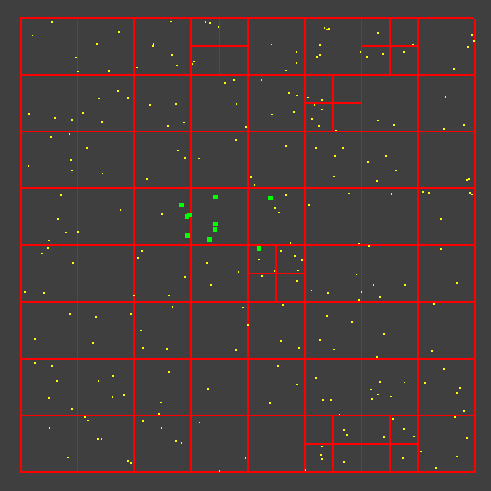

### This can use for collision detection optimization or something else.



-  `points`
-  `queried points`

Example of usage

```Java
        QuadTreeRectangle boundary = new QuadTreeRectangle(250, 250, 500, 500);
        
        quadTree = new QuadTree(
                boundary, // bounds
                4 // capacity of tree
        );
        
        // add some points
        for (int i = 0; i < 250; i++) {
            QuadTreePoint p = new QuadTreePoint(
                    boundary.x - 250 + MathUtils.random() * 500,
                    boundary.y - 250 + MathUtils.random() * 500
            );
            quadTree.insert(p);
        }

        // query the points inside the rectangle
        QuadTreeRectangle range = new QuadTreeRectangle(225, 175 + 100, 107, 75);
        points = quadTree.query(range);
```